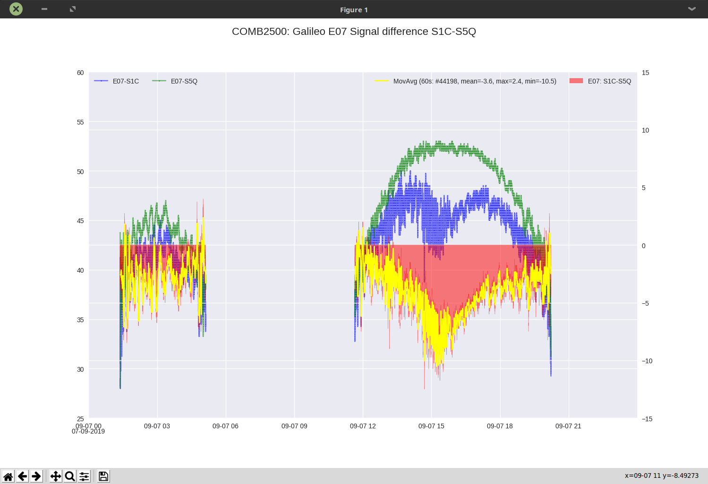
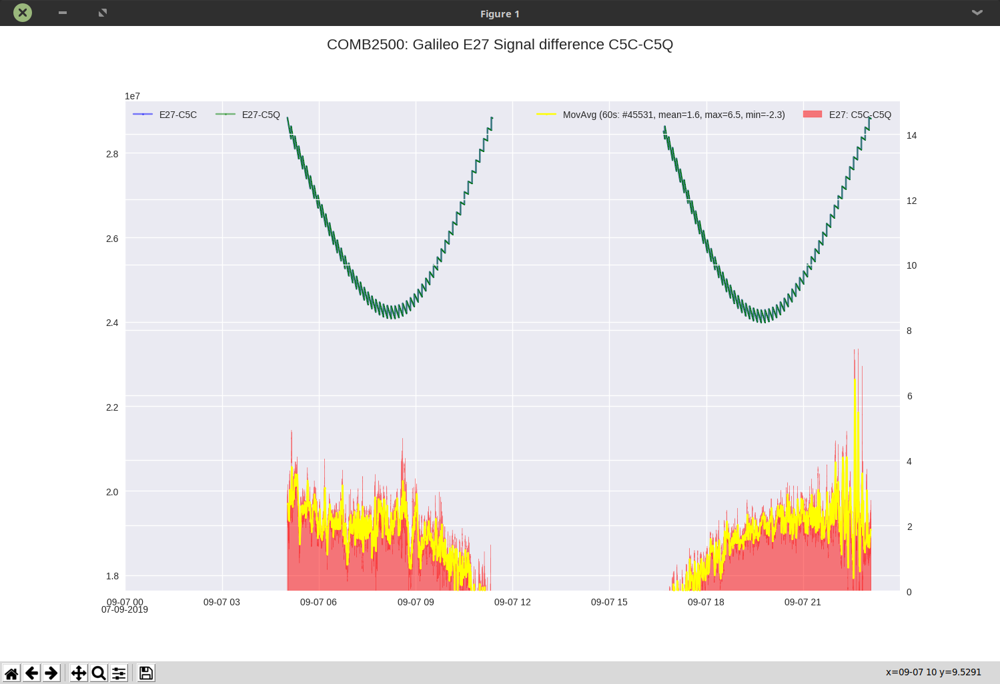

---
geometry: a4paper
...

# `pyRinex`  repository

## Introduction

The `pyRinex` repository is based on the [`georinex` repository](https://github.com/scivision/georinex) which reads `RINEX v3` and `RINEX v2` and performs batch conversion to `NetCDF4/HDF5` in Python or Matlab. Using the `NetCDF4/HDF5` format gives far faster access to the observables than parsing a `RINEX` observation file.

Please consult the `Readme` file on this page which is from `georinex` or visit the [`georinex` repository](https://github.com/scivision/georinex).

## Batch conversion of `RINEX` files using `rnx2hdf5`

```bash
$ rnx2hdf5 -h
usage: rnx2hdf5 [-h] [-o OUT] [-v] [-p] [-u USE [USE ...]]
                [-m MEAS [MEAS ...]] [-t TLIM TLIM] [-useindicators] [-strict]
                indir [glob]

example of reading RINEX 2/3 Navigation/Observation file

positional arguments:
  indir                 path to RINEX 2 or RINEX 3 files to convert
  glob                  file glob pattern

optional arguments:
  -h, --help            show this help message and exit
  -o OUT, --out OUT     write data to path or file as NetCDF4
  -v, --verbose
  -p, --plot            display plots
  -u USE [USE ...], --use USE [USE ...]
                        select which GNSS system(s) to use
  -m MEAS [MEAS ...], --meas MEAS [MEAS ...]
                        select which GNSS measurement(s) to use
  -t TLIM TLIM, --tlim TLIM TLIM
                        specify time limits (process part of file)
  -useindicators        use SSI, LLI indicators (signal, loss of lock)
  -strict               do not use speculative preallocation (slow) let us
                        know if this is needed

```

An example run on directory `/media/amuls/RXTURPBACKUP/BEGPIOS/ASTX/19250` converting all `RINEX` observation files `*.0.19O` (Galileo, GPS and COMB) putting the converted output in directory `/media/amuls/RXTURPBACKUP/BEGPIOS/ASTX/19250/nc` is:


```bash
$ rnx2hdf5 /media/amuls/RXTURPBACKUP/BEGPIOS/ASTX/rinex/19250 *0.19O -o /media/amuls/RXTURPBACKUP/BEGPIOS/ASTX/rinex/19250/nc/ -v
INFO:root:opening 217.534199 MByte GPSS2500.19O
INFO:root:opening 217.534199 MByte GPSS2500.19O
INFO:root:opening 217.534199 MByte GPSS2500.19O
saving OBS: /media/amuls/RXTURPBACKUP/BEGPIOS/ASTX/rinex/19250/nc/GPSS2500.19O.nc
saving OBS: /media/amuls/RXTURPBACKUP/BEGPIOS/ASTX/rinex/19250/nc/GALI2500.19O.nc
INFO:root:opening 308.463966 MByte COMB2500.19O
INFO:root:opening 308.463966 MByte COMB2500.19O
INFO:root:opening 308.463966 MByte COMB2500.19O
saving OBS: /media/amuls/RXTURPBACKUP/BEGPIOS/ASTX/rinex/19250/nc/COMB2500.19O.nc
```

Executing `rnx2hdf5` on daily `RINEX` files is very time consuming (takes hours), the above conversion took about 17 hours.

## Python scripts 

### Script `rnxplot.py`

`rnxplot.py` is a graphical `PyQT5` based program that reads `RINEX` observation files or `NetCDF4/HDF5` files to plot the observables. The preferred way is to previously convert the `RINEX` observation file to the `NetCDF4/HDF5` format as input for `rnxplot.py`.

The conversion from `RINEX` to `NetCDF4/HDF5` takes a long time, especially for daily files. This conversion is done using the `georinex` provided file `rnx2hdf5`. The following is an example of converting the daily observation files from an `AsteRx` receiver for Galileo only, GPS only and Galileo+GPS observations. It took about 27 hours to complete.


```bash
$ rnx2hdf5 /media/amuls/RXTURPBACKUP/BEGPIOS/ASTX/rinex/19250 *0.19O -o /media/amuls/RXTURPBACKUP/BEGPIOS/ASTX/rinex/19250/nc/ -v
INFO:root:opening 217.534199 MByte GPSS2500.19O
INFO:root:opening 217.534199 MByte GPSS2500.19O
INFO:root:opening 217.534199 MByte GPSS2500.19O
saving OBS: /media/amuls/RXTURPBACKUP/BEGPIOS/ASTX/rinex/19250/nc/GPSS2500.19O.nc
saving OBS: /media/amuls/RXTURPBACKUP/BEGPIOS/ASTX/rinex/19250/nc/GALI2500.19O.nc
INFO:root:opening 308.463966 MByte COMB2500.19O
INFO:root:opening 308.463966 MByte COMB2500.19O
INFO:root:opening 308.463966 MByte COMB2500.19O
```

The `RINEX` to `NetCDF4/HDF5` conversion can be done without user interaction and yields a enormous time gain afterwards since reading the `NetCDF/HDF5` files is much faster than reading the `RINEX` observation file during the analysis.

The script `rnxplot.py` is more usable for the interference tests  (which have shorter observation times). The following figure shows the start window of  `rnxplot.py`, while subsequent figures show plots created.


Running `enxplot.py` also creates comma separated values or `CSV` files stored in the sub directory `csv`, which can be used for further analysis (e.g. using a spreadsheet)

\newpage

### Script `rnxdiff.py`

Using the created `CSV` files,  `rnxdiff.py` makes a comparison (difference) between observables on 2 different frequencies.

```bash
$ rnxdiff.py --help
usage: rnxdiff.py [-h] [-d DIR] -f FILES FILES -g GNSS -s SIGNALS SIGNALS
                  [-m MOVAVG]
                  [-l {CRITICAL,ERROR,WARNING,INFO,DEBUG,NOTSET} {CRITICAL,ERROR,WARNING,INFO,DEBUG,NOTSET}]

rnxdiff.py compares between similar signals of different navigation services

optional arguments:
  -h, --help            show this help message and exit
  -d DIR, --dir DIR     Directory of SBF file (defaults to .)
  -f FILES FILES, --files FILES FILES
                        Filenames of 2 CSV files to compare
  -g GNSS, --gnss GNSS  GNSS System Name
  -s SIGNALS SIGNALS, --signals SIGNALS SIGNALS
                        Signal names to compare
  -m MOVAVG, --movavg MOVAVG
                        moving average of difference [sec] (defaults 60s)
  -l {CRITICAL,ERROR,WARNING,INFO,DEBUG,NOTSET} {CRITICAL,ERROR,WARNING,INFO,DEBUG,NOTSET}, --logging {CRITICAL,ERROR,WARNING,INFO,DEBUG,NOTSET} {CRITICAL,ERROR,WARNING,INFO,DEBUG,NOTSET}
                        specify logging level console/file (default INFO
                        DEBUG)
```

An example for running a comparison between signal strengths and pseudo-ranges for Galileo Open Service signals on E1 and E5 is:

```bash
$ /home/amuls/amPython/pyRinex/am/rnxdiff.py -g Galileo -s S1C S5Q \
  -d ~/RxTURP/BEGPIOS/ASTX/rinex/19250/nc/csv/ \
  -f COMB2500-19O-nc-E-S1C.csv  COMB2500-19O-nc-E-S5Q.csv

$ /home/amuls/amPython/pyRinex/am/rnxdiff.py -g Galileo -s C5C C5Q \
  -d ~/RxTURP/BEGPIOS/ASTX/rinex/19250/nc/csv/ \
  -f COMB2500-19O-nc-E-C1C.csv  COMB2500-19O-nc-E-C5Q.csv
```

which produces following plots (plots are saved in a `png` sub-directory). On the pseudo-range  plot, the influence of the 1ms clock jumps are clearly visible. The difference and a moving average of the difference are calculated.




